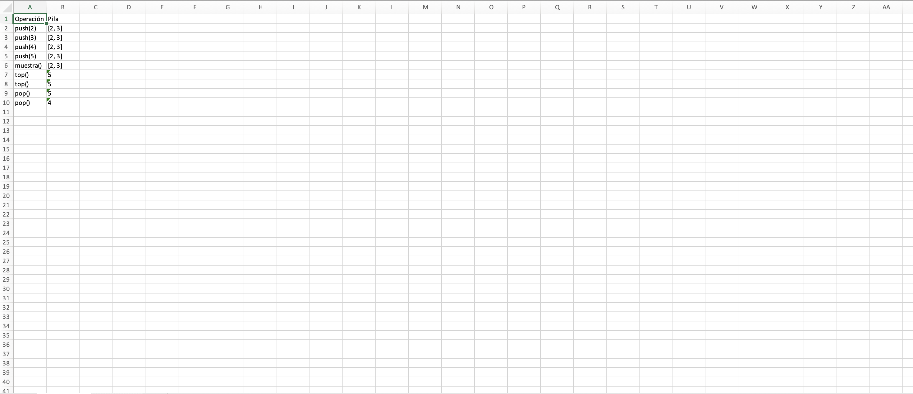
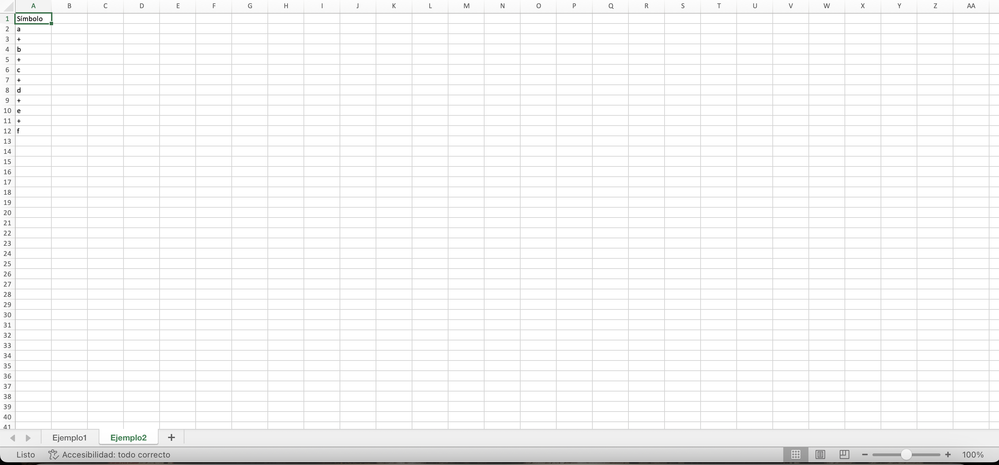

# Simulación de Gramáticas con Python

Este proyecto simula el comportamiento de dos ejercicios relacionados con pilas y análisis léxico, generando un archivo Excel con los resultados. A continuación, se explica el funcionamiento del código y cómo utilizarlo.

---

## Descripción del Proyecto

El proyecto consta de dos partes principales:

### 1. Simulación de una Pila
   - Implementa una pila utilizando la clase `Pila`.
   - Permite realizar operaciones como `push`, `pop`, `top` y `muestra`.
   - Los resultados de las operaciones se registran en un archivo Excel.

### 2. Análisis Léxico
   - Implementa un analizador léxico con la clase `Lexico`.
   - Simula la lectura de símbolos de una cadena de entrada.
   - Los símbolos leídos se registran en un archivo Excel.

---

## Requisitos

Para ejecutar este proyecto, necesitas:

- Python 3.x instalado.
- La siguiente biblioteca de Python:
  - `openpyxl` (para generar archivos Excel).

Puedes instalar la dependencia ejecutando:

```bash
pip install openpyxl
```

---

## Estructura del Código

### Clases y Funciones

- **Clase `Pila`**: Implementa una pila con métodos como `push`, `pop`, `top`, `muestra` e `is_empty`.
- **Clase `Lexico`**: Implementa un analizador léxico que lee símbolos de una cadena de entrada.
- **Función `ejemplo1`**: Simula operaciones con una pila y devuelve los resultados en formato de lista.
- **Función `ejemplo2`**: Simula el análisis léxico de una cadena y devuelve los símbolos leídos.

### Generación del archivo Excel

Se utiliza la biblioteca `openpyxl` para crear un archivo Excel con dos hojas:

- **Ejemplo1**: Contiene los resultados de las operaciones con la pila.
- **Ejemplo2**: Contiene los símbolos leídos por el analizador léxico.

---

## Ejecución del Código

Para ejecutar el código, sigue estos pasos:

1. Clona o descarga el repositorio.
2. Abre una terminal en la carpeta del proyecto.
3. Ejecuta el siguiente comando:

```bash
python main.py
```

Después de ejecutar el código, se generará un archivo llamado `simulacion_gramaticas.xlsx` en la misma carpeta.

---

## Capturas de Pantalla

1. **Ejecución del Código**  
   

2. **Hoja 1 del Archivo Excel (Ejemplo 1: Pila)**  
   

3. **Hoja 2 del Archivo Excel (Ejemplo 2: Análisis Léxico)**  
   

---

## Resultados Esperados

### Archivo Excel:
El archivo `simulacion_gramaticas.xlsx` contendrá dos hojas:

- **Ejemplo1**: Muestra las operaciones realizadas con la pila y su estado en cada paso.
- **Ejemplo2**: Muestra los símbolos leídos por el analizador léxico.

### Salida en Consola:
El programa imprimirá un mensaje indicando que el archivo Excel se ha generado correctamente.

---

## Autor
Desarrollado por Brandon Chavez
