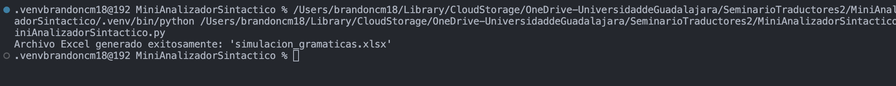

# Mini Analizador Sintáctico

Este proyecto es un **mini analizador sintáctico** implementado en C++. Su objetivo es procesar cadenas de entrada según una gramática simple y generar un archivo CSV con los resultados. El programa utiliza una pila para procesar la entrada y verifica si las cadenas cumplen con las reglas gramaticales definidas.

---

## Funcionalidades

1. **Verificación sintáctica**:
   - El programa verifica si una cadena de entrada cumple con una gramática simple:
     - Solo se permiten letras (`a-z`, `A-Z`) y el símbolo `+`.
     - No se permiten dos `+` consecutivos.

2. **Procesamiento de la entrada**:
   - **Ejemplo 1**: Procesa la cadena `Hola+Mundo` usando una pila. Ignora los símbolos `+` y apila solo las letras. Luego, realiza operaciones como `top` y `pop`.
   - **Ejemplo 2**: Procesa la cadena `a+b+c+d+e+f`. Ignora los símbolos `+` y muestra los caracteres restantes.

3. **Generación de un archivo CSV**:
   - El programa genera un archivo CSV (`mini_analizador_sintactico.csv`) con los resultados de ambos ejercicios.

---

## Estructura del código

El código está organizado en las siguientes funciones:

1. **`esValida`**:
   - Verifica si una cadena de entrada cumple con la gramática definida.

2. **`ejemplo1`**:
   - Procesa la cadena `Hola+Mundo` usando una pila y realiza operaciones como `top` y `pop`.

3. **`ejemplo2`**:
   - Procesa la cadena `a+b+c+d+e+f` y muestra los caracteres restantes.

4. **`main`**:
   - Ejecuta los ejemplos y genera el archivo CSV.

---

## Ejecución del programa

### Captura de pantalla del código en ejecución



*Nota: La captura de pantalla muestra la salida en la terminal al ejecutar el programa.*

---

### Formato del archivo CSV generado

El archivo `mini_analizador_sintactico.csv` tiene el siguiente formato:

| Ejercicio      | Entrada         | Resultado         |
|----------------|-----------------|-------------------|
| Ejercicio 1    | Hola+Mundo      | H o l a M u n d o |
| Ejercicio 1 Tope | Hola+Mundo    | o                 |
| Ejercicio 1 Tope | Hola+Mundo    | o                 |
| Ejercicio 1 Pop | Hola+Mundo     | o                 |
| Ejercicio 1 Pop | Hola+Mundo     | l                 |
| Ejercicio 2    | a+b+c+d+e+f     | a b c d e f       |

---

### Captura de pantalla del archivo CSV


*Nota: La captura de pantalla muestra el archivo CSV abierto en Excel.*

---

## Requisitos

- Compilador de C++ (por ejemplo, `g++`).
- Estándar C++11 o superior (para soportar bucles de rango).

---

## Compilación y ejecución

1. Clona el repositorio o descarga el archivo `MiniAnalizadorSintactico.cpp`.
2. Compila el programa con el siguiente comando:

   ```bash
   g++ MiniAnalizadorSintactico.cpp -o MiniAnalizadorSintactico -std=c++11

   ```bash
   ./MiniAnalizadorSintactico

